# Installing the Recharm Plugin for Claude

This guide walks you through installing the **Recharm** plugin in the Claude desktop app by adding our marketplace from GitHub, installing the plugin, and connecting it to your Recharm account.

The whole process takes about 2 minutes.

## Prerequisite

> [!IMPORTANT]
> **Make sure you are logged into Recharm before you start.**
> The final step authorizes Claude to access your Recharm account, so you need an active Recharm session in your browser. If you don't have an account yet, sign up at [recharm.com](https://app.recharm.com/auth) first.

---

## Step 1 — Open Cowork

In the Claude app, click the **Cowork** tab at the top.

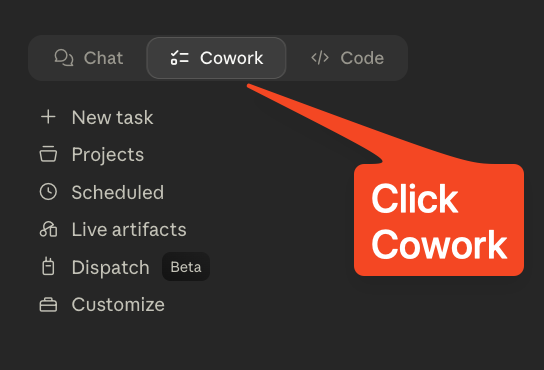

## Step 2 — Open Customize

In the Cowork sidebar, click **Customize**.

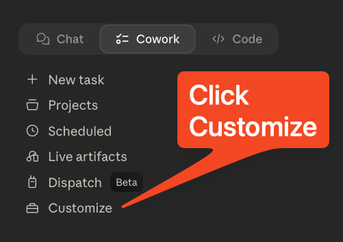

## Step 3 — Add a marketplace

Under **Personal plugins**, click the **＋** button, hover **Create plugin**, then choose **Add marketplace**.

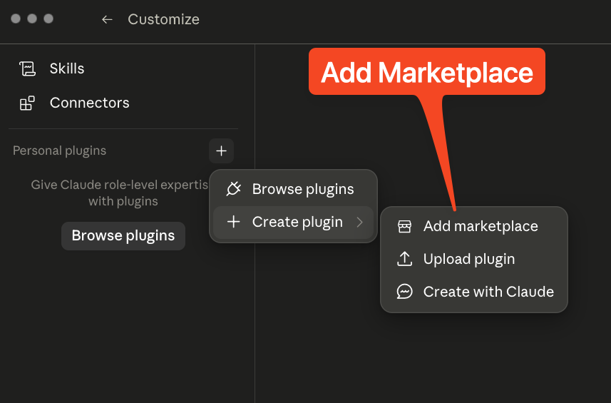

## Step 4 — Add from a repository

In the _Add marketplace_ dialog, choose **Add from a repository** to sync a marketplace from a GitHub URL.

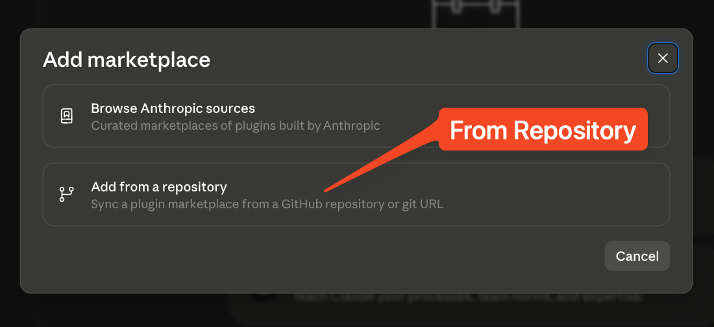

## Step 5 — Paste the Recharm GitHub URL

Paste the Recharm plugin repository URL into the field:

```
https://github.com/recharm/claude-plugin
```

If the repository list doesn't load, just click **Use "https://github.com/recharm/claude-plugin"** to continue.

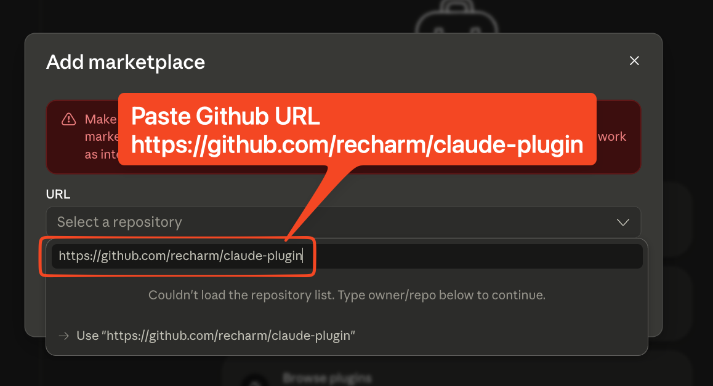

## Step 6 — Sync the marketplace

Confirm the URL is filled in and click **Sync**.

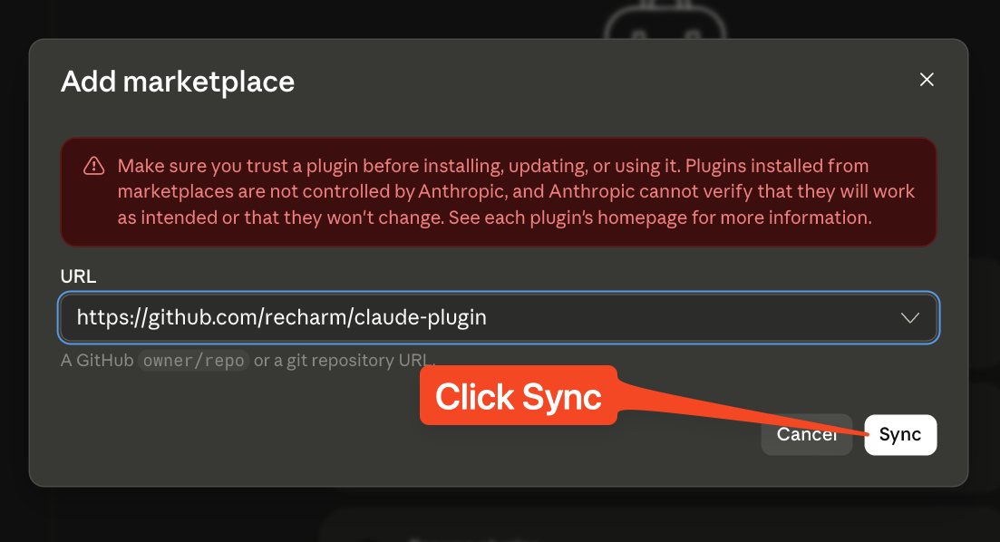

## Step 7 — Turn on automatic sync (recommended)

Open the **⋯** menu next to `claude-plugin` and turn on **Sync automatically**. This keeps the Recharm plugin up to date as we ship new features.

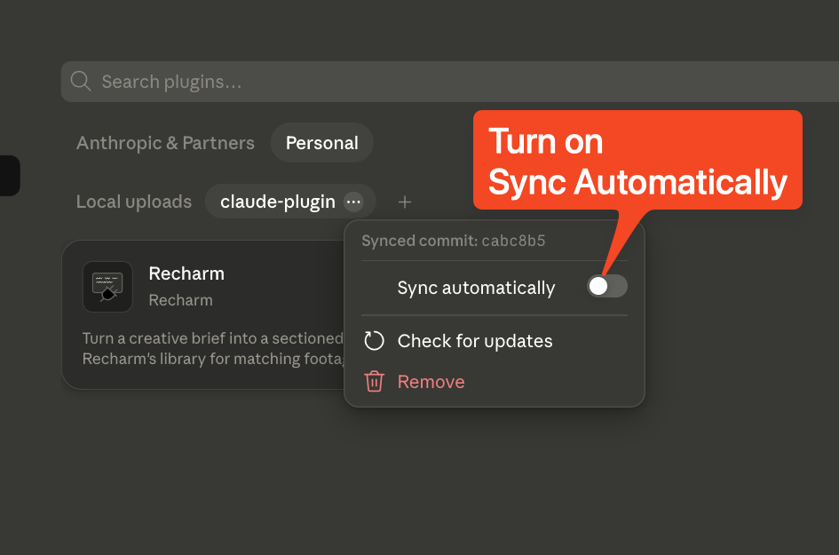

## Step 8 — Install the Recharm plugin

Go to **Plugins** in the directory. Find the **Recharm** card under _Local uploads_ and click the **＋** to install it.

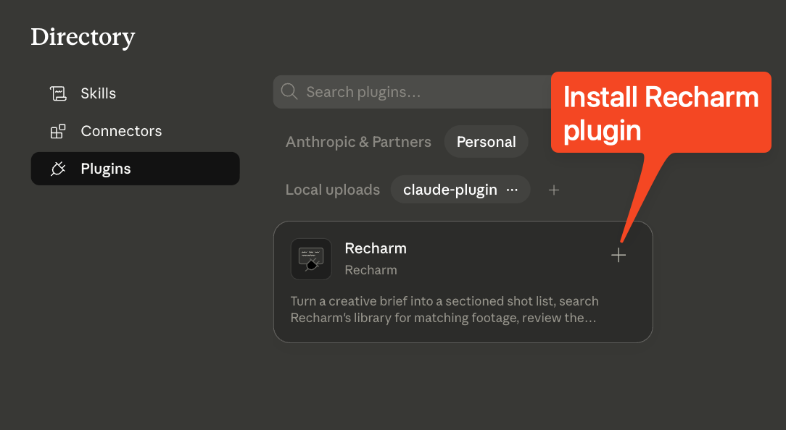

## Step 9 — Open the Recharm connector

Back under **Personal plugins → Recharm**, click **Connectors**.

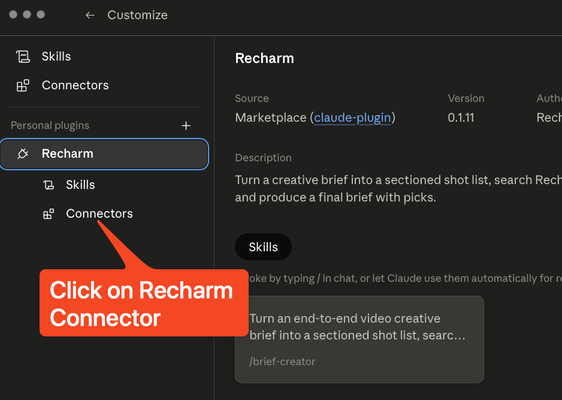

## Step 10 — Install the connector

Click **Install** next to the Recharm connector.

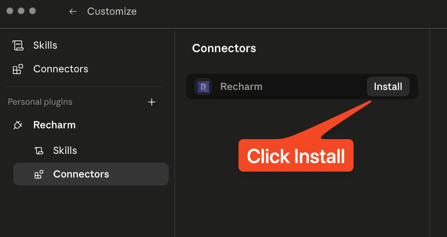

## Step 11 — Connect to Recharm

Click **Connect**. This points to `https://mcp.recharm.com/mcp` and starts the authorization flow.

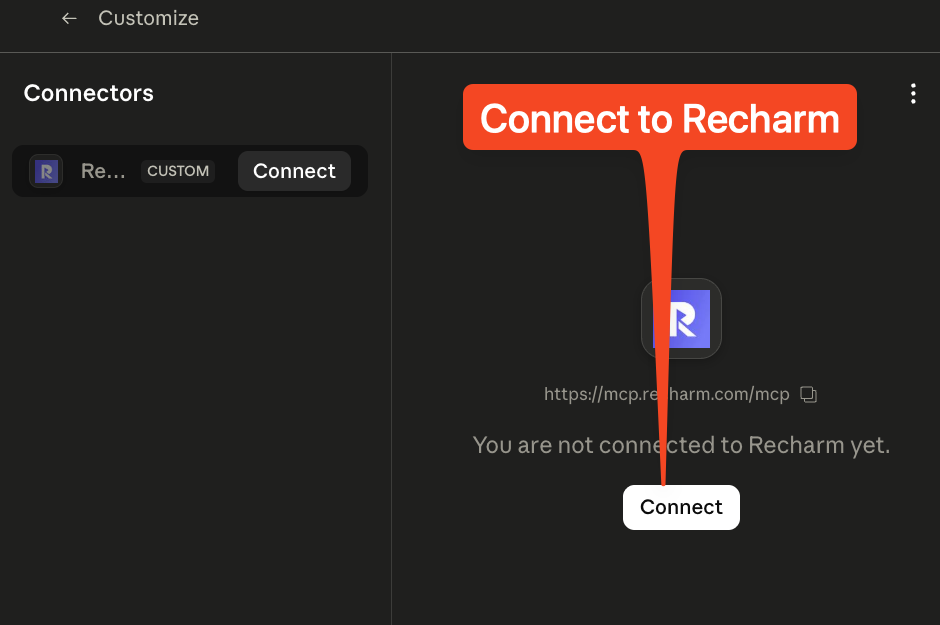

## Step 12 — Authorize Claude

A Recharm authorization page opens in your browser. Click **Approve** to let Claude access your Recharm account.

> This is why you need to be logged into Recharm beforehand.

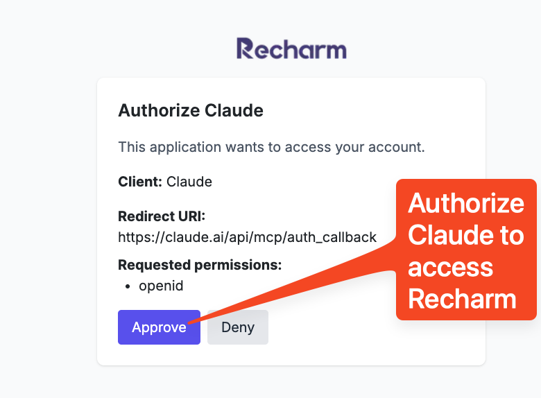

## Step 13 — Reopen the Claude app

Your browser will ask to hand you back to the Claude app. Click **Open Claude** to return.

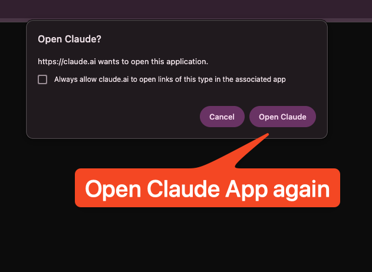

## Step 14 — You're all set! 🎉

Back in the connector view, you'll see all Recharm tools available — `search_clips_visually`, `list_brands`, `list_labels`, `save_brief`, and more. The Recharm plugin is now installed and connected.

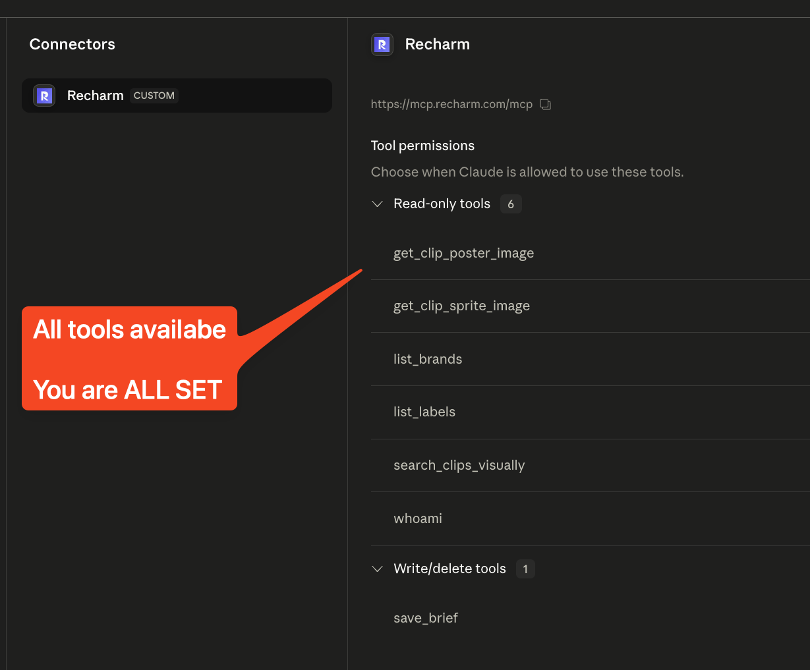

---

## What's next?

Try the Recharm skills directly in chat — for example, type `/brief-creator` to turn a creative brief into a sectioned shot list with matching footage from your Recharm library.

Need help? Reach out to the Recharm team and we'll get you sorted.
